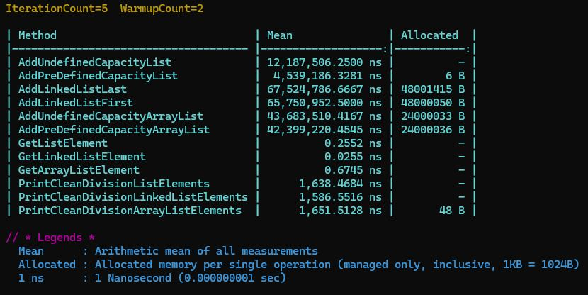

# 8. Массив и лист

## Сравнение коллекций

### Цель

Сделать сравнение по скорости работы List, ArrayList и LinkedList.

**Описание/Пошаговая инструкция выполнения домашнего задания:**

1. Создать коллекции `List`, `ArrayList` и `LinkedList`.
2. С помощью цикла `for` добавить в каждую `1 000 000` случайных значений с помощью [класса Random](https://youtu.be/ZYFm6cW-Q8k?si=v3rhsPnv6v9lkryG).
3. С помощью `Stopwatch.Start()` и `Stopwatch.Stop()` замерить длительность заполнения каждой коллекции и вывести значения на экран.
4. Найти `496753`-ий элемент, замерить длительность этого поиска и вывести на экран.
5. Вывести на экран каждый элемент коллекции, который без остатка делится на `777`. Вывести длительность этой операции для каждой коллекции.
Укажите сколько времени вам понадобилось, чтобы выполнить это задание.

**Критерии оценки:**

* Пункты 1-3 - 6 баллов
* Пункт 4 - 2 балла
* Пункт 5 - 2 балла

Для зачёта домашнего задания достаточно 6 баллов.

## Решение

Решение было реализовано при помощи библитеки [BenchmarkDotNet](https://github.com/dotnet/BenchmarkDotNet)

### Вывод программы:

### Описание вывода

Для удобства восприятия результаты предоставлены в:
* мс - миллисекунда;
* нс - наносекунда.

| Метод | Коллекция | Описание метода | Среднее значение | Аллоцировано памяти (B) |
|:-------:|:---------:|:-----------------------------:|:--------:|:--------:|
| AddUndefinedCapacityList | List | Добавление элементов в List без предустановленного размера | 12.1875062500 мс | - |
| AddPreDefinedCapacityList | List | Добавление элементов в List с указанным при создании размером | 4.5391863281 мс | 6 |
| AddLinkedListLast | LinkedList | Добавление элементов в конец LinkedList | 67.5247866667 мс | 48001415 |
| AddLinkedListFirst | LinkedList | Добавление элементов в начало LinkedList | 65.7509525 мс | 48000050 |
| AddUndefinedCapacityArrayList | ArrayList | Добавление элементов в ArrayList без предустановленного размера | 43.6835104167 мс | 24000033 |
| AddPreDefinedCapacityArrayList | ArrayList | Добавление элементов в ArrayList с указанным при создании размером | 42.3992204545 мс | 24000036 |
| GetListElement | List | Получение элемента List | 0.2552 нс | - |
| GetLinkedListElement | LinkedList | Получение элемента LinkedList | 0.0255 нс | - |
| GetArrayListElement | ArrayList | Получение элемента ArrayList | 0.6745 нс | - |
| PrintCleanDivisionListElements | List | Печать элементов List, делящихся без остатака на заданное число | 1638.4684 нс | - |
| PrintCleanDivisionLinkedListElements | LinkedList | Печать элементов LinkedList, делящихся без остатака на заданное число | 1586.5516 нс | - |
| PrintCleanDivisionArrayListElements | ArrayList | Печать элементов ArrayList, делящихся без остатака на заданное число | 1651.5128 нс | 48 |

