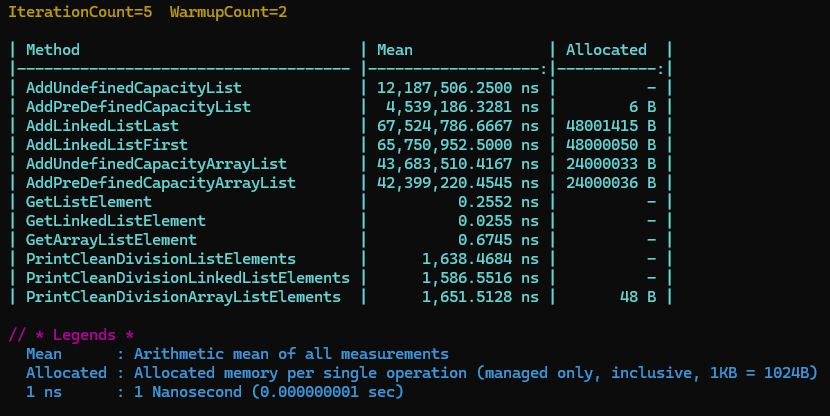

# 8. Массив и лист

## Сравнение коллекций

### Цель

Сделать сравнение по скорости работы List, ArrayList и LinkedList.

**Описание/Пошаговая инструкция выполнения домашнего задания:**

1. Создать коллекции `List`, `ArrayList` и `LinkedList`.
2. С помощью цикла `for` добавить в каждую `1 000 000` случайных значений с помощью [класса Random](https://youtu.be/ZYFm6cW-Q8k?si=v3rhsPnv6v9lkryG).
3. С помощью `Stopwatch.Start()` и `Stopwatch.Stop()` замерить длительность заполнения каждой коллекции и вывести значения на экран.
4. Найти `496753`-ий элемент, замерить длительность этого поиска и вывести на экран.
5. Вывести на экран каждый элемент коллекции, который без остатка делится на `777`. Вывести длительность этой операции для каждой коллекции.
Укажите сколько времени вам понадобилось, чтобы выполнить это задание.

**Критерии оценки:**

* Пункты 1-3 - 6 баллов
* Пункт 4 - 2 балла
* Пункт 5 - 2 балла

Для зачёта домашнего задания достаточно 6 баллов.

## Решение

Решение было реализовано при помощи библитеки [BenchmarkDotNet](https://github.com/dotnet/BenchmarkDotNet)

### Вывод программы:

### Описание вывода

Для удобства восприятия результаты предоставлены в:
* мс - миллисекунда;
* нс - наносекунда.

| Метод | Коллекция | Описание метода | Среднее значение | Медиана |
|:-------:|:---------:|:-----------------------------:|:--------:|:--------:|
| AddUndefinedCapacityList | List | Добавление элементов в List без предустановленного размера | 4.4582974609 мс | 4.4579585938 мс |
| AddPreDefinedCapacityList | List | Добавление элементов в List с указанным при создании размером | 7.1857934375 мс | 4.3354859375 мс |
| AddLinkedListLast | LinkedList | Добавление элементов в конец LinkedList | 65.1017281250 мс | 65.0899875000 мс |
| AddLinkedListFirst | LinkedList | Добавление элементов в начало LinkedList | 68.2315392857 мс | 68.0127642857 мс |
| AddUndefinedCapacityArrayList | ArrayList | Добавление элементов в ArrayList без предустановленного размера | 44.2371520833 мс | 44.7082916667 мс |
| AddPreDefinedCapacityArrayList | ArrayList | Добавление элементов в ArrayList с указанным при создании размером | 47.9104204545 мс | 48.6000136364 мс |
| GetListElement | List | Получение элемента List | 0.0007 нс | 0.0000 нс |
| GetLinkedListElement | LinkedList | Получение элемента LinkedList | 0.0101 нс | 0.0000 нс |
| GetArrayListElement | ArrayList | Получение элемента ArrayList | 0.6712 нс | 0.6682 нс |
| PrintCleanDivisionListElements | List | Печать элементов List, делящихся без остатака на заданное число | 1650.2056 нс | 1646.1262 нс |
| PrintCleanDivisionLinkedListElements | LinkedList | Печать элементов LinkedList, делящихся без остатака на заданное число | 1569.5351 нс | 1550.6031 нс |
| PrintCleanDivisionArrayListElements | ArrayList | Печать элементов ArrayList, делящихся без остатака на заданное число | 1598.4214 нс | 1604.2610 нс |

