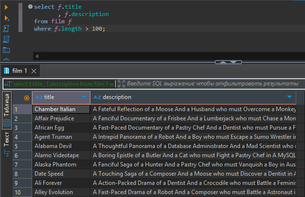
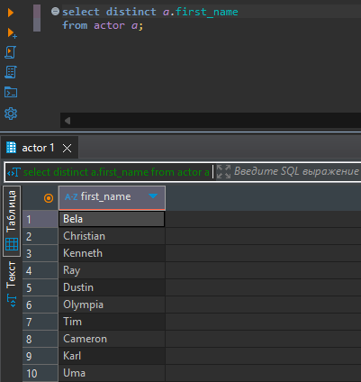
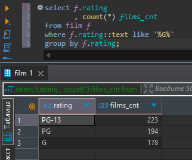
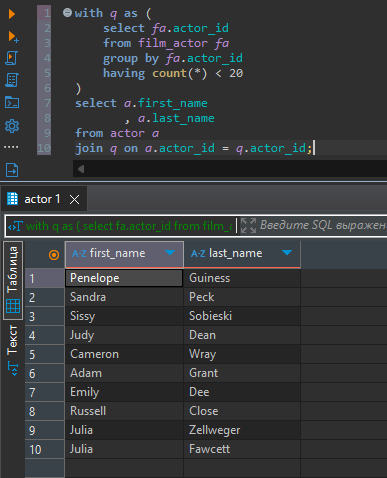

# Домашняя работа №14

Выборки данных

## Цель
1. Установить на локальный компьютер `PostgreSQL` (см. ссылки в презентации).
2. Скачать и восстановить БД `dvdrental` с помощью `pgAdmin` (см. ссылки в презентации). Приложить скриншот с `pgAdmin`.
3. В `pgAdmin` (или `Navicat`) написать SQL запрос, который вернет названия и описания всех фильмов, продолжительность которых больше `100`. Приложить скриншот с SQL запросом и результирующей выборкой.
4. В `pgAdmin` (или `Navicat`) написать SQL запрос, который вернет уникальные имена (без фамилий) актеров. Приложить скриншот с SQL запросом и результирующей выборкой.
5. В `pgAdmin` (или `Navicat`) написать SQL запрос, который вернет рейтинг фильма и количество фильмов с таким рейтингом, но только для тех рейтингов, которые содержат букву "G". Приложить скриншот с SQL запросом и результирующей выборкой.
6. В `pgAdmin` (или `Navicat`) написать SQL запрос, который вернет имена и фамилии только тех актеров, которые снимались менее, чем в `20` фильмах. Приложить скриншот с SQL запросом и результирующей выборкой.

## Описание/Пошаговая инструкция выполнения домашнего задания:

См. вебинар.

## Критерии оценки
* Пункты 1-2: 4 баллов
* Пункт 3: 1 балл
* Пункт 4: 1 балл
* Пункт 5: 2 балла
* Пункт 6: 2 балла
* Минимальный проходной балл: 6.

## Решение

Названия и описания всех фильмов, продолжительность которых больше 100:

```sql
select f.title
       , f.description 
from film f
where f.length > 100; 
```


Уникальные имена (без фамилий) актеров:

```sql
select distinct a.first_name
from actor a;
```


Рейтинг фильма и количество фильмов с таким рейтингом, но только для тех рейтингов, которые содержат букву "G":

```sql
select f.rating
       , count(*) films_cnt
from film f
where f.rating::text like '%G%'
group by f.rating;
```


Имена и фамилии только тех актеров, которые снимались менее, чем в 20 фильмах:

```sql
with q as (
	select fa.actor_id
	from film_actor fa
	group by fa.actor_id
	having count(*) < 20
)
select a.first_name
       , a.last_name
from actor a
join q on a.actor_id = q.actor_id;
```

