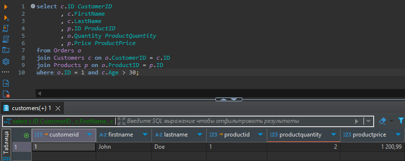

# Домашняя работа №15

Индексы: кластерный и не кластерный

## Цель
Тренируем навык работы с таблицами, связями между ними индексами

## Описание/Пошаговая инструкция выполнения домашнего задания:

1. В СУБД `PostgreSQL` создать БД `Shop`
2. Создать таблицы `Customers` (`ID`, `FirstName`, `LastName`, `Age`), `Products` (`ID`, `Name`, `Description`, `StockQuantity`, `Price`) и `Orders` (`ID`, `CustomerID`, `ProductID`, `Quantity`)
3. Установить между ними соответствующие связи по внешним ключам (в каждой таблице поле `ID` является первичным ключом)
4. Заполнить таблицы произвольными значениями (с корректными значениями для внешних ключей). В каждой таблице не менее 10 записей.
5. Написать запрос, который возвращает список всех пользователей старше 30 лет, у которых есть заказ на продукт с `ID` = 1. Используйте alias, чтобы дать столбцам в результирующей выборке понятные названия. В результате должны получить таблицу:
`CustomerID`, `FirstName`, `LastName`, `ProductID`, `ProductQuantity`, `ProductPrice`
6. Убедитесь, что вы повесили необходимый некластерный индекс (он не особо нужен, когда у вас 10 записей, но пригодится, если бы их было 1000)

## Критерии оценки
* Задание выполнено - 10 баллов
* Задание не выполнено - 0 баллов

## Решение

SQL запрос:

```sql
select c."ID" CustomerID
       , c."FirstName"
       , c."LastName"
       , p."ID" ProductID
       , o."Quantity" ProductQuantity
       , p."Price" ProductPrice
from public."Orders" o
join public."Customers" c on o."CustomerID" = c."ID"
join public."Products" p on o."ProductID" = p."ID"
where c."Age" > 30 and p."ID" = 1;
```

