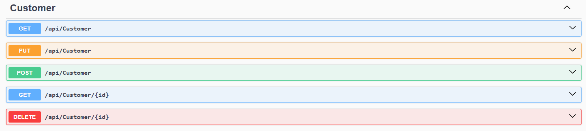
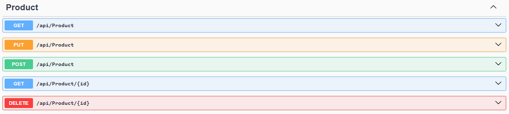
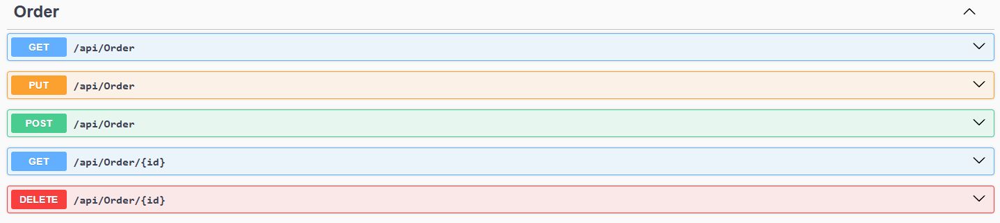

# Домашняя работа №16

Dapper / Linq2sql

## Цель
Получить навык работы с БД из программы, получения выборки и последующей ее обработки.
Получить опыт работы с ORM Dapper (Linq2Db)

## Описание/Пошаговая инструкция выполнения домашнего задания:

0. Определиться с `ORM`: `Dapper` (`Linq2Db`).
1. Выбрать какую БД использовать (из задания `Sql запросы` или `Кластерный индекс`), написать строку подключения к БД и использовать ее для подключения. (опираться можно на пример из материалов)
2. Создать классы, которые описывают таблицы в БД
3. Используя `ORM` выполнить простые запросы к каждой таблице, выполнить параметризованные запросы к каждой таблице (без `JOIN`) - 2-3 запроса на таблицу.
4. Значения параметров для фильтрации можно как задавать из консоли, так и значениями переменных в коде. (пример `GetStudent`)
5. Выполнить все запросы, из выбранного ранее задания с передачей параметров.

## Критерии оценки
* 0-3: 9 баллов
* 4: +1 балл

## Решение

### CustomerController

### ProductController

### OrderController

